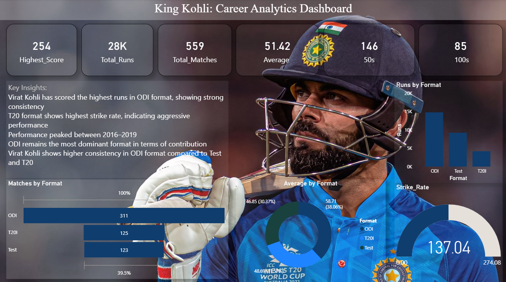

# 🏏 Virat Kohli Career Analytics Dashboard (Power BI)

## 📊 Project Overview
This project is an interactive Power BI dashboard analyzing the career performance of Virat Kohli across different formats.

## 🔍 Key Insights
- ODI format contributes the highest runs, showing strong consistency  
- T20 format has the highest strike rate, indicating aggressive performance  
- Peak performance observed between 2016–2019  
- ODI remains the most dominant format  
- Higher consistency in ODI compared to Test and T20  

## 🛠 Tools Used
- Power BI  
- Power Query  
- DAX  

## 📁 Files Included
- `dashboard.pbix` – Power BI file  
- `dataset.csv` – Dataset used  
- `dashboard.png` – Dashboard preview  

## 📌 Project Outcome
This project demonstrates data cleaning, transformation, visualization, and storytelling skills.

---
⭐ If you like this project, feel free to star the repository!
